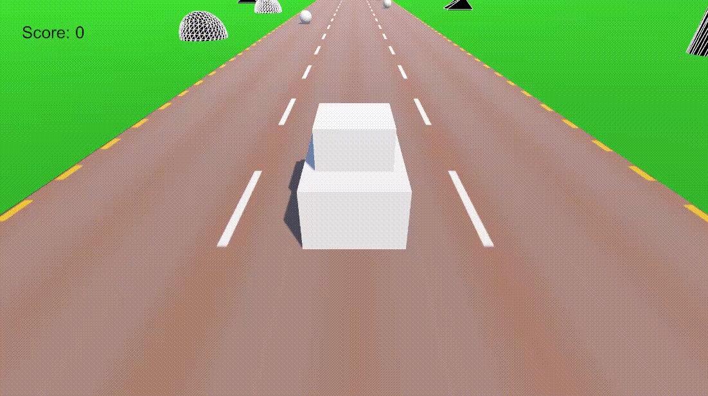

# Endless Runner ECS

Проект представляет собой бесконечный Runner, реализованный с LeoECS Lite. Основной целью проекта было построение масштабируемой и расширяемой архитектуры.

Проект можно открыть в Unity 2021.3.45 или скачать сборку под Windows в разделе Releases.

---

# Стек

- Unity 2021.3.45f1 LTS
- C#
- LeoECS Lite

---

# Используемые подходы и технологии

- **Entity Component System** - игровая логика полностью реализована через LeoECS Lite.
- **Composition Root** - инициализация инфраструктуры и регистрация ECS-систем сосредоточены в `GameStartup`.
- **Runtime Data Mapping** - игровые системы работают с immutable runtime данными, а не напрямую с `ScriptableObject`.
- **Object Pool** - повторное использование дорожных блоков и игровых объектов.
- **ScriptableObject** - используется для конфигурации игровых параметров.
- **Dependency Injection** - зависимости передаются в ECS-системы через конструкторы.

---

# Особенности проекта

- Бесконечная генерация дороги через двухуровневую систему пулов.
- Иллюзия движения за счет смещения мира, а не игрока.
- Gameplay отделен от Unity View.
- Независимые подсистемы дороги, объектов и HUD.
- Низкая связанность между ECS и Unity.

---

# Архитектура проекта

Проект построен по принципу разделения ответственности между данными, игровой логикой, инфраструктурой и представлением.
Игровая логика полностью находится в ECS-системах. Unity используется только для отображения объектов, хранения конфигурации и инициализации приложения.

## Основные уровни архитектуры

### Config

Все игровые параметры редактируются через `ScriptableObject`.
Конфигурация не используется непосредственно игровыми системами и применяется только на этапе инициализации проекта.

---

### Runtime Data

Во время запуска конфигурация преобразуется в immutable runtime данные (`PlayerData`, `RoadData`, `RoadObjectData`, `WorldData`).
Благодаря этому игровые системы не зависят от ScriptableObject напрямую и работают с подготовленными данными.

---

### ECS

Игровая логика полностью реализована внутри ECS.
Каждая система отвечает только за одну небольшую задачу:
- обработка ввода;
- движение игрока;
- движение мира;
- генерация дороги;
- генерация игровых объектов;
- сбор объектов;
- обновление HUD.

Компоненты являются исключительно контейнерами данных и не содержат поведения.

---

### View

`MonoBehaviour` используются только как представление.
Они отвечают за:
- хранение ссылок на Unity-компоненты;
- работу с `Transform`;
- отображение пользовательского интерфейса.

Вся игровая логика остается внутри ECS, а синхронизация между ECS и Unity выполняется специализированными системами.